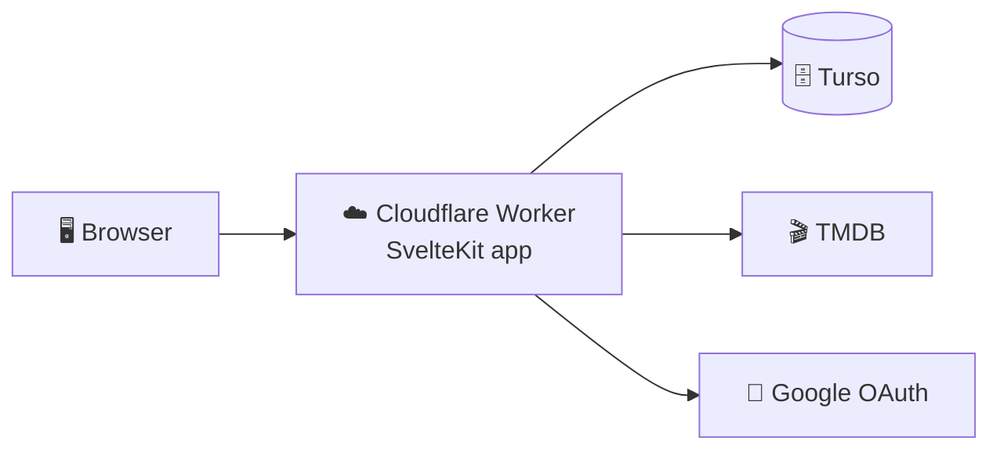

<p align="center">
  
</p>

<p align="center">
  <b>Search films and TV, save them, and never lose your place in a series.</b><br>
  Progress tracked down to the episode you stopped on, streaming availability in your
  country, and suggestions drawn from your own list.
</p>

<p align="center">
  <a href="https://nextsode.cloudils.com">Live demo</a> ·
  <a href="https://github.com/Isma-L154/nextsode/issues">Report a bug</a> ·
  <a href="#running-locally">Run it locally</a>
</p>

---

## What it does

- **Sign in with Google** — your list is private to your account.
- **Search and trending**, proxied server-side so the TMDB token never reaches the browser.
- **Suggestions from your list** — rows of "because you watched X", built from what you actually finished rather than from what is popular this week.
- **Season and episode tracking** — a bookmark down to the episode, and nothing that has not aired can be ticked off, so a show is never marked watched ahead of broadcast. Finishing the aired seasons marks you _caught up_, and a new season brings the show back on its own. ([design notes](docs/season-progress.md))
- **Where to watch** — streaming, rental and purchase options for your country.
- **Coming soon** — pending films and seasons grouped by how soon they arrive.
- **Auto-delete** — optionally clear watched titles off your list after 7, 30 or 90 days. Off by default, each card warns you for the last week with a one-tap **Keep**, and anything with a new season on the way is never touched.

## How it works



The browser talks to the Worker and nothing else — every credential stays inside
it.

Two conventions carry most of the codebase: decision logic lives in
`src/lib/domain` as pure functions with their own unit tests, and anything under
`src/lib/server` can never reach the browser. Upkeep (refreshing season data,
deleting expired titles) runs on page load rather than on a timer, so there is
no cron job to operate.

**Stack:** SvelteKit 5 · TypeScript · Tailwind 4 · Drizzle + Turso (libSQL) ·
Cloudflare Workers

## Running locally

Needs Node 22+, a free [TMDB](https://www.themoviedb.org/settings/api) token and
a Google OAuth client.

```bash
npm install
cp .env.example .env    # fill in the values below
npm run db:migrate
npm run dev             # http://localhost:5173
```

| Variable               | Description                                                                        |
| ---------------------- | ---------------------------------------------------------------------------------- |
| `TMDB_ACCESS_TOKEN`    | TMDB v4 **API Read Access Token** (Bearer).                                        |
| `DATABASE_URL`         | `file:local.db` locally, or a `libsql://…turso.io` URL in production.              |
| `DATABASE_AUTH_TOKEN`  | Turso auth token. Leave empty for the local file database.                         |
| `GOOGLE_CLIENT_ID`     | OAuth 2.0 client ID.                                                               |
| `GOOGLE_CLIENT_SECRET` | OAuth 2.0 client secret.                                                           |
| `OAUTH_ORIGIN`         | _Optional._ Public origin for the redirect URI; derived from the request if unset. |

> ⚠️ `.env` is git-ignored and must never be committed.

**Google sign-in:** in the
[Cloud Console](https://console.cloud.google.com/apis/credentials), create an
OAuth client ID for a Web application and add one redirect URI per environment —
`http://localhost:5173/auth/google/callback` and
`https://<your-domain>/auth/google/callback`. Only `openid`, `profile` and
`email` are requested, and no Google tokens are stored.

Other scripts: `npm run lint`, `npm run check`, `npm run test:unit`,
`npm run test:e2e`.

`npm run brand` regenerates the README banner from `docs/brand/banner.html`. It
is drawn rather than painted — same palette, typefaces and film mark as the app —
so editing that file and re-running the script is how the image changes.

`npm run gen` regenerates `worker-configuration.d.ts` from the bindings in
`wrangler.jsonc`. Run it when you add or change a binding, and commit the
result. Run it on a clean tree: `wrangler types` adds an extra `GlobalProps`
interface pointing at the built worker when `.svelte-kit/cloudflare/_worker.js`
happens to exist, so regenerating after a build produces a file that differs
from the one CI generates.

## Deployment

Pushes to `main` deploy to Cloudflare automatically once CI passes. That needs
one repository secret, `CLOUDFLARE_API_TOKEN` (Cloudflare → My Profile → API
Tokens → template _Edit Cloudflare Workers_).

First-time setup:

```bash
turso db create nextsode   # put the URL + token in .env, then:
npm run db:migrate           # apply the schema to the remote database

# Production secrets are not read from .env:
npx wrangler secret put TMDB_ACCESS_TOKEN
npx wrangler secret put DATABASE_URL
npx wrangler secret put DATABASE_AUTH_TOKEN
npx wrangler secret put GOOGLE_CLIENT_ID
npx wrangler secret put GOOGLE_CLIENT_SECRET
```

To deploy by hand: `npm run build && npx wrangler deploy`.

## Security

- Secrets live only in `src/lib/server/*`, which SvelteKit guarantees is never bundled for the client.
- Sign-in uses OAuth 2.0 with PKCE and a `state` parameter; the database stores only a SHA-256 hash of the session token, so a dump cannot be replayed as a session.
- Every watchlist read _and_ write is scoped by the session's user id — item ids travel through the browser, so knowing one is not enough to touch someone else's list.
- Input is length- and range-checked before it reaches the database, and season targets are always resolved server-side.
- Personal responses are `private, no-store`; only the public TMDB proxies are edge-cached.

## License

Private project — all rights reserved (for now).
